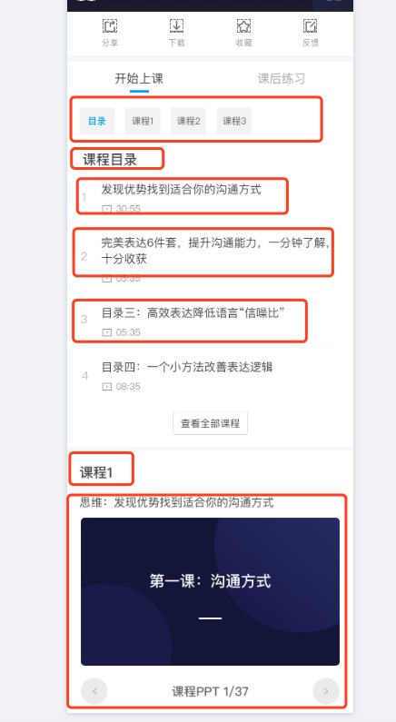

# flutter

### 跨平台技术简介

1. webview 渲染

   用 JavaScript 等前端技术进行开发，在客户端上用 WebView 来进行渲染。如微信小程序，cordova 等，

   优点：使用成熟的前端技术进行开发，学习成本低，开发效率高，并且支持动态发布代码。

   缺点：在性能体验上，和原生还是存在较大差距的。

2. 原生控件渲染

   这种方案，同样也是使用 JavaScript 开发，区别是它最终是调用原生控件进行渲染，如 React Native

   优点：使用原生控件进行渲染，性能体验也会更接近原生。

   缺点：但也只是更接近，和原生还是有差距的，因为它需要频繁的进行 JavaScript 和原生之间的通信，这个通信效率是比较低的。比如 RN 是通过 Jscore 解析 jsbunder 文件布局，和原生直接布局还是有那么一丁点差距的。由于需要适配各个平台的控件，那就有可能出现，系统控件更新了，而框架本身还没有更新，由此产生了一些问题。换句话说，这种方案是受到原生控件限制的。

3. 绘图引擎 Skia

   flutter 的 UI 渲染是基于 skia 图像引擎完成的，不依赖任何一个系统平台，平台仅仅提供一个画布，让 图像渲染在画布上。那么直接越过原生的渲染机制，从自身的渲染引擎去渲染视图，这就和原生一模一样，没有了中间商赚差价。

> 除了渲染上的区别，对于和原生服务的调用，别入照相、拍照、蓝牙，视频等，1 和 2 都是通过 bridge 协议来通讯的。3 flutter 是 用 Platform channel 的形式去调用系统服务

### 基础

flutter 开发语言：[dart](https://dart.dev/guides)

flutter [官方文档地址](https://flutter.dev/docs)

flutter [仓库地址](https://pub.dev)

### 学习路径

---

-- 入门 --

[中文文档地址](https://flutterchina.club/docs),按照上述的地址，完成起步的练习，初步了解 flutter 的使用，安装还有入门的过程中没有遇到阻碍，文档的安装和入门还是很亲和的。起步以后需要弄懂下面这二个基本的概念

#### 概念

1. widget

   不同于 Web 把页面分成了 HTML，CSS，JS， 在 Flutter 中，所有东西都是 widget 具体 widget 类型

   - 元素 widget。 如 button，menu，list
   - 样式 widget。如 font，color
   - 布局 widget。 如 padding，margin

   所有的 widget 嵌套组合在一起，就构成了一个 flutter app。

2. 状态

   分为 StatefulWidget 有状态 widget、StatelessWidget 无状态 widget

   - StatelessWidget 是不可变的, 这意味着它们的属性不能改变 - 所有的值都是最终的

   - StatefulWidget 当一个控件是可变的时候，就要使用 StatefulWidget 来构建。StatefulWidget 本身不可变，但它持有的状态 State 是可变的。

#### dart

flutter 使用 dart 作为开发语言，因此需要了解一下 dart 的基本语法

看了几遍 [dart 语法](https://www.jianshu.com/p/9e5f4c81cc7d)，这里的一些概括以后，简单的了解下语法，后续遇到问题，都是重新搜索文档，或者度娘搜索解决

---

-- 开发 --

有了上述简短的一些使用体验以后，开始开发我们自己的应用

从下面几个点开始深入开发

- 生命周期
- 布局、样式、交互
- 路由
- http 请求
- 状态
- 调试

#### 1 **生命周期**

##### 组件渲染

flutter 中的视图 Widget 也存在生命周期，生命周期的回调函数提现在了 State 上面。理解 flutter 的生命周期，对我们写出一个合理的控件至关重要。组件 State 的生命周期整理如下图所示：


大致可以看成三个阶段

    - 初始化（插入渲染树）
    - 状态改变（在渲染树中存在）
    - 销毁（从渲染树种移除）

1. initState：插入渲染树时调用，只调用一次，widget 创建执行的第一个方法，可以再里面初始化一些数据网络请求等，以及绑定控制器

2. didChangeDependencies：当 State 对象的依赖发生变化时会被调用；例如：在之前 build() 中包含了一个 InheritedWidget，然后在之后的 build() 中 InheritedWidget 发生了变化，那么此时 InheritedWidget 的子 widget 的 didChangeDependencies()回调都会被调用。InheritedWidget 这个 widget 可以由父控件向子控件共享数据，案例可以参考 scoped_model 开源库。

3. build ：它主要是用于构建 Widget 子树的，调用次数：多次，初始化之后开始绘制界面，当 setState 触发的时候会再次被调用

4. didUpdateWidget：组件状态改变时候调用，可能会调用多次

5. deactivate:当 State 对象从树中被移除时，会调用此回调。

6. dispose():当 State 对象从树中被永久移除时调用；通常在此回调中释放资源。

7. reassemble：此回调是专门为了开发调试而提供的，在热重载(hot reload)时会被调用，此回调在 Release 模式下永远不会被调用。
   几个注意点

二个页面之前的切换的流程如图


##### flutter 前后台交互

在我们原生 Android（或者 IOS）开发中，很多是否要在对应的生命周期做一些事件，例如 App 从后台进入前台，从前台退入后台（或被遮盖），以及需要在确保 UI 绘制后做一些处理，这在我们原生开发中很容易做到，那么在 Flutter 中需要怎么去做呢？

很简单，给 WidgetsBinding 设置 Observer

```

class _MyHomePageState extends State<MyHomePage> with WidgetsBindingObserver{

  @override
  void initState() {
    super.initState();
    WidgetsBinding.instance.addObserver(this); // 添加观察者
  }

  @override
  void didChangeAppLifecycleState(AppLifecycleState state) {
    super.didChangeAppLifecycleState(state);
    print("lifeChanged $state");
    switch (state) {
      case AppLifecycleState.inactive: // 用户可见，但不可响应用户操作
        break;
      case AppLifecycleState.resumed: // 应用可见并可响应用户操作
        break;
      case AppLifecycleState.paused: // 已经暂停了，用户不可见、不可操作
        break;
      case AppLifecycleState.suspending: // 应用被挂起，此状态IOS永远不会回调
        break;
    }
  }

  @override
  void dispose() {
    super.dispose();
    WidgetsBinding.instance.removeObserver(this); // 销毁
  }

  @override
  Widget build(BuildContext context) {
    return Container();
  }
}

```

我们只要给 WidgetsBinding 的单例对象添加 WidgetsBindingObserver，然后此类粘合(with)WidgetsBindingObserver 抽象类

```
abstract class WidgetsBindingObserver {

   //路由弹出Future
  Future<bool> didPopRoute() => Future<bool>.value(false);

    //新的路由Future
  Future<bool> didPushRoute(String route) => Future<bool>.value(false);

    //系统窗口相关改变回调，例如旋转
  void didChangeMetrics() { }

    //文字系数变化
  void didChangeTextScaleFactor() { }

    //本地化语言变化
  void didChangeLocales(List<Locale> locale) { }

    //生命周期变化
  void didChangeAppLifecycleState(AppLifecycleState state) { }

    //低内存回调
  void didHaveMemoryPressure() { }

    //当前系统改变了一些访问性活动的回调
  void didChangeAccessibilityFeatures() {}
}
```

其中我们重写了 override 了 didChangeAppLifecycleState，这个方法有一个参数类型为 AppLifecycleState 的枚举类，我们可以根据它的状态来处理我们的一些任务。

---

#### 2 **布局、样式、交互**

布局组件

-- 基础组件 --

1. Container

   容器，一个常用的控件，由基本的绘制、位置和大小控件组成。负责创建矩形的可视元素，可以用 BoxDecoration 来设计样式，比如背景、边框和阴影，Container 也有边距、填充和大小限制，另外，还可以在三维空间利用矩阵进行变换。

   推荐文章介绍，[地址](https://www.jianshu.com/p/366b2446eaab)

2. Row

   在水平方向上排列子 widget 的列表。

   表现形式跟 web 的 flex 类似,可以完成参照 flex 布局的介绍

   其中用的比较多的就是

   MainAxisAlignment 设置主轴方向上的对齐方式

   CrossAxisAlignment 设置交叉轴方向的对齐方式

   输入的时候会有提示拥有的可以设置的属性，比较简单

   ```
    Row(
        children: <Widget>[
            Expanded(
            child: Container(
                color: Colors.red,
                padding: EdgeInsets.all(5.0),
            ),
            flex: 1,
            ),
            Expanded(
            child: Container(
                color: Colors.yellow,
                padding: EdgeInsets.all(5.0),
            ),
            flex: 2,
            ),
            Expanded(
            child: Container(
                color: Colors.blue,
                padding: EdgeInsets.all(5.0),
            ),
            flex: 1,
            ),
        ],
    )
   ```

   一个很简单的例子，使用 Expanded 控件，将一行的宽度分成四个等分，第一、三个 child 占 1/4 的区域，第二个 child 占 1/2 区域，由 flex 属性控制。

3. Column

   在垂直方向上排列子 widget 的列表。
   表现形式跟 web 的 flex 类似,可以完成参照 flex 布局的介绍

   ```
    new Column(
        mainAxisAlignment: MainAxisAlignment.spaceEvenly,
        mainAxisSize: MainAxisSize.max,
        crossAxisAlignment: CrossAxisAlignment.center,
        verticalDirection: VerticalDirection.down,
        // textDirection:,
        textBaseline: TextBaseline.alphabetic,
        children: <Widget>[
            Container(
                color: Colors.red,
                height: 30,
                width: 30,
            ),
            Container(
                color: Colors.blue,
                height: 30,
                width: 30,
            ),
            Container(
                color: Colors.yellow,
                height: 30,
                width: 30,
            ),
        ],
    ),

   ```

4. Image

   一个显示图片的 widget

   推荐文档 [地址](https://www.jianshu.com/p/9b21dca71e3f)

   推荐使用 [cached_network_image](https://pub.dev/packages/cached_network_image) 去处理图片，可以很方便的增加图片 loading 效果，还有加载失败的效果

5. Text

   单一格式的文本

   ```
    new Text(
        '学习Text',
        textAlign: TextAlign.center, // 文本对齐方式  居中
        textDirection: TextDirection.ltr, // 文本方向
        softWrap: false, // 是否自动换行 false文字不考虑容器大小  单行显示   超出；屏幕部分将默认截断处理
        overflow: TextOverflow
            .ellipsis, // 文字超出屏幕之后的处理方式  TextOverflow.clip剪裁   TextOverflow.fade 渐隐  TextOverflow.ellipsis省略号
        textScaleFactor: 2.0, // 字体显示的倍率
        maxLines: 10, // 最大行数
        style: new TextStyle(
        decorationColor: const Color(0xffffffff), // 线的颜色
        decoration: TextDecoration
            .none, // none无文字装饰   lineThrough删除线   overline文字上面显示线    underline文字下面显示线
        decorationStyle: TextDecorationStyle
            .solid, // 文字装饰的风格  dashed,dotted虚线(简短间隔大小区分)  double三条线  solid两条线
        wordSpacing: 0.0, // 单词间隙(负值可以让单词更紧凑)
        letterSpacing: 0.0, // 字母间隙(负值可以让字母更紧凑)
        fontStyle: FontStyle.italic, // 文字样式，斜体和正常
        fontSize: 20.0, // 字体大小
        fontWeight: FontWeight.w900, // 字体粗细  粗体和正常
        color: const Color(0xffffffff), // 文字颜色
    ),

   ```

6. Icon

   A Material Design icon.
   系统提供的一些 icon 样式安卓风格
   或者使用 [cupertino_icons](https://pub.dev/packages/cupertino_icons) iOS 风格 icon

7. Input

   推荐文档 [地址](https://juejin.im/post/5c20787fe51d4554055562fd#heading-6)

   ```
   const TextField({
       Key key,
       this.controller,    //编辑框的控制器，跟文本框的交互一般都通过该属性完成，如果不创建的话默认会自动创建
       this.focusNode,  //用于管理焦点
       this.decoration = const InputDecoration(),   //输入框的装饰器，用来修改外观
       TextInputType keyboardType,   //设置输入类型，不同的输入类型键盘不一样
       this.textInputAction,   //用于控制键盘动作（一般位于右下角，默认是完成）
       this.textCapitalization = TextCapitalization.none,
       this.style,    //输入的文本样式
       this.textAlign = TextAlign.start,   //输入的文本位置
       this.textDirection,    //输入的文字排列方向，一般不会修改这个属性
       this.autofocus = false,   //是否自动获取焦点
       this.obscureText = false,   //是否隐藏输入的文字，一般用在密码输入框中
       this.autocorrect = true,   //是否自动校验
       this.maxLines = 1,   //最大行
       this.maxLength,   //能输入的最大字符个数
       this.maxLengthEnforced = true,  //配合maxLength一起使用，在达到最大长度时是否阻止输入
       this.onChanged,  //输入文本发生变化时的回调
       this.onEditingComplete,   //点击键盘完成按钮时触发的回调，该回调没有参数，(){}
       this.onSubmitted,  //同样是点击键盘完成按钮时触发的回调，该回调有参数，参数即为当前输入框中的值。(String){}
       this.inputFormatters,   //对输入文本的校验
       this.enabled,    //输入框是否可用
       this.cursorWidth = 2.0,  //光标的宽度
       this.cursorRadius,  //光标的圆角
       this.cursorColor,  //光标的颜色
       this.keyboardAppearance,
       this.scrollPadding = const EdgeInsets.all(20.0),
       this.dragStartBehavior = DragStartBehavior.down,
       this.enableInteractiveSelection,
       this.onTap,    //点击输入框时的回调(){}
       this.buildCounter,
   })

   InputDecoration({
       this.icon,    //位于装饰器外部和输入框前面的图片
       this.labelText,  //用于描述输入框，例如这个输入框是用来输入用户名还是密码的，当输入框获取焦点时默认会浮动到上方，
       this.labelStyle,  // 控制labelText的样式,接收一个TextStyle类型的值
       this.helperText, //辅助文本，位于输入框下方，如果errorText不为空的话，则helperText不会显示
       this.helperStyle, //helperText的样式
       this.hintText,  //提示文本，位于输入框内部
       this.hintStyle, //hintText的样式
       this.hintMaxLines, //提示信息最大行数
       this.errorText,  //错误信息提示
       this.errorStyle, //errorText的样式
       this.errorMaxLines,   //errorText最大行数
       this.hasFloatingPlaceholder = true,  //labelText是否浮动，默认为true，修改为false则labelText在输入框获取焦点时不会浮动且不显示
       this.isDense,   //改变输入框是否为密集型，默认为false，修改为true时，图标及间距会变小
       this.contentPadding, //内间距
       this.prefixIcon,  //位于输入框内部起始位置的图标。
       this.prefix,   //预先填充的Widget,跟prefixText同时只能出现一个
       this.prefixText,  //预填充的文本，例如手机号前面预先加上区号等
       this.prefixStyle,  //prefixText的样式
       this.suffixIcon, //位于输入框后面的图片,例如一般输入框后面会有个眼睛，控制输入内容是否明文
       this.suffix,  //位于输入框尾部的控件，同样的不能和suffixText同时使用
       this.suffixText,//位于尾部的填充文字
       this.suffixStyle,  //suffixText的样式
       this.counter,//位于输入框右下方的小控件，不能和counterText同时使用
       this.counterText,//位于右下方显示的文本，常用于显示输入的字符数量
       this.counterStyle, //counterText的样式
       this.filled,  //如果为true，则输入使用fillColor指定的颜色填充
       this.fillColor,  //相当于输入框的背景颜色
       this.errorBorder,   //errorText不为空，输入框没有焦点时要显示的边框
       this.focusedBorder,  //输入框有焦点时的边框,如果errorText不为空的话，该属性无效
       this.focusedErrorBorder,  //errorText不为空时，输入框有焦点时的边框
       this.disabledBorder,  //输入框禁用时显示的边框，如果errorText不为空的话，该属性无效
       this.enabledBorder,  //输入框可用时显示的边框，如果errorText不为空的话，该属性无效
       this.border, //正常情况下的border
       this.enabled = true,  //输入框是否可用
       this.semanticCounterText,
       this.alignLabelWithHint,
   })

   ```

8. ListView
   可滚动的列表视图
   推荐文档 [地址](https://juejin.im/post/5cb1c9d5f265da037371777f)

-- 系统提供的二种 ui 风格 --

- Cupertino (iOS)

- Material (Android)

  需要了解 [App 结构和导航](https://www.jianshu.com/p/add5a6e5c87a)

-- 屏幕适配 --

推荐 [地址](https://juejin.im/post/5bc5a56a5188255c352d88fe)

> 上述只是简单介绍了一下页面布局用的常见的一些元素，还有很多组件比如动画等其他组件还有静态文件资源的等处理请自行查阅文档,

-- 布局思路 --

首先整体拆解，然后局部拆分

如图


然后对头部练习主体进一步拆解

对评论列表进行拆解

思路基本跟前端的布局一样，如果不熟悉的情况下，可以在给每个部分增加背景颜色查看效果

-- 实践过程中的一些经验总结 --

1. 颜色和边距类

   Colors 有很多默认的颜色值，输入的时候会有提示
   自定义颜色 Color(0xff4caf50)
   在 flutter 中，color 使用的是 ARGB，0x 后面的就是 ARGB，A 就是 FF 表示透明度，RGB 就是三原色了，上述对应的 web 端的#4caf50

   Color.fromRGBO(int r, int g, int b, double opacity) 类似 web 的 rgba

   EdgeInsets 通常用来设置间距的大小，输入的时候提示也比较明显

2. 关于 刘海屏适配

   [SafeArea](https://juejin.im/post/5ce73cc2f265da1b68369645)

3. 键盘弹起，页面整体往上移

   使用 resizeToAvoidBottomInset 指定在键盘出现时是否应调整主体的大小
   可以在 Scaffold 里面 resizeToAvoidBottomInset 设置为 false 页面就不会往上弹

4. 类似于前端的 display: none

   可以使用 Offstage 包起来。设置 offstage 属性
   当 offstage 为 true，控件隐藏； 当 offstage 为 false，显示；
   当 Offstage 不可见的时候

5. 禁止表单的点击

   AbsorbPointer 可以想象成 web 端的遮罩，众所周知周知，禁止表单的点击时间有 disabled，但是这样一来，如果页面比较复杂，要控制表单元素是否可点那可成了灾难，这时候 AbsorbPointer 就可以快速解决这个问题。我们可以把它看成是一个透明的穹顶，一旦打开，从外部是无法到达内部。不过有一点值得注意，如果一个输入框已经获取焦点，然后再打开穹顶，输入框还是可以输入的。

   属性

   - absorbing 布尔类型，字面意思是吸收，通俗点讲这个属性就是用来控制其 child 里面的组件是否可以点击，通常用的最多的也是这个属性。

   - child Widget 类型，可以是任何组件。

   - ignoringSemantics 布尔类型，是否忽略语义。经测试没什么影响，一般使用比较少。

6. 手势操作

   使用 [GestureDetector](https://www.jianshu.com/p/dc4853c33562)
   还有一些常用的简单带动画效果的 InkWell

7. tab 的切换

   可以使用 TabBarView,也可以使用 Pageview,或者直接使用 IndexedStack
   前面二种带动画可以左右华东，IndexedStack 如果也想要动画，推荐包括一层[这个](https://github.com/best-flutter/transformer_page_view)

8. 布局小技巧，占位

   有些 padding,和 margin 不想包起来的情况下，可以直接用 SizedBox 去占位

9. wrap 换行。

   http://www.ptbird.cn/flutter-wrapper.html

10. 前端的类似重叠位置的布局

    使用 Stack ,和 Positioned [地址](https://www.jianshu.com/p/387d730cbe92)

11. 导航返回拦截，避免用户误触返回按钮而导致 APP 退出

    http://www.apkbus.com/flutter_book/chapter7/willpopscope.html

12. 修改状态栏字体颜色

    https://www.jianshu.com/p/15700d9145aa

13. 滚动处理

    对于一些滚动复杂有横向和竖向滚动，部分滚动元素需要固定在头部的情况，比如一些页面由 banner,tab,content 组成，滚动以后需要吧 tab 固定在头部等，那么你需要了解下这个[Sliver 组件](https://juejin.im/post/5cb3405ae51d456e442ff310)

---

#### 3 **路由**

1.  了解 flutter 提供的路由

    推荐[文档地址](https://juejin.im/post/5cad8dd0f265da039955c27d#heading-7)

2.  推荐使用 fluro

    [fluro](https://github.com/theyakka/fluro)

    1. 配置路由地址 /router/routes.dart

    ```
     import 'package:fluro/fluro.dart';
     import 'package:flutter/material.dart';
     import './route_handlers.dart';

     class Routes {
         static String root = "/";
         static String home = "/home";
         static String my = "/my";
         static String login = "/login";
         // 对路由进行配置，define进行定义handler是回调
         static void configureRoutes(Router router) {
             router.notFoundHandler = Handler(
                 handlerFunc: (BuildContext context, Map<String, List<String>> params) {
             print("该路由没有找到");
             });
             router.define(root, handler: rootHandler);
             router.define(home, handler: homeHandler);
             router.define(my, handler: myRouteHandler);
             router.define(login, handler: loginRouterHandler);
         }
     }

    ```

    2.  路由映射的 hanlder 方法 /routes/route_handlers.dart

    ```

         import 'package:myapp/page/my.dart';
         import 'package:myapp/page/login.dart';
         import 'package:myapp/page/page_container.dart';

         import 'package:myapp/common/utils/fluro_convert_util.dart';
         import 'package:fluro/fluro.dart';
         import 'package:flutter/material.dart';

         Handler homeHandler = Handler(
             handlerFunc: (BuildContext context, Map<String, List<String>> params) {
         return PageContainer();
         });

         Handler rootHandler = Handler(
             handlerFunc: (BuildContext context, Map<String, List<String>> params) {
         return My();
         });

         Handler myRouteHandler = Handler(
             handlerFunc: (BuildContext context, Map<String, List<String>> params) {
         return My();
         });

         Handler loginRouterHandler = Handler(
             handlerFunc: (BuildContext context, Map<String, List<String>> params) {
         return Login();
         });

    ```

    3. 定义 router 实例，方便调用，/router/application

    ```
        import 'package:fluro/fluro.dart';

        class Application {
            static Router router;
        }

    ```

    4. 使用

    应用入口里面需要先挂载一下

    ```
        @override
        Widget build(BuildContext context) {
            return MaterialApp(
            title: 'myapp',
            theme: ThemeData(
                primaryColor: ThemeUtils.currentColorTheme,
            ),
            home: SplashPage(),
            onGenerateRoute: Application.router.generator, // 挂载路由
            navigatorKey: navigatorKey,
            );
        }
    ```

    ```
    import 'package:fluro/fluro.dart';
    import 'package:myapp/router/application.dart';
    import 'package:myapp/router/routers.dart';

    Application.router.navigateTo(
      context,
      address,
      transition: TransitionType.native, // 可以定义不同的动画
      replace: false, // 是否使用replace
    );
    ```

    5. 路由传参，和不支持中文等处理

    https://juejin.im/post/5d051a5b6fb9a07ec07fbdc5

    上述实践过程中，有些特殊复杂的参数，如果不好处理，可以直接使用没有封装的跳转处理

    ```
    void gotoAudioPage(Context<CourseDetailState> ctx) async {
        await Navigator.of(ctx.context)
            .push(new MaterialPageRoute(builder: (BuildContext context) {
            // 生成音频页面，传递当前课程详情state给音频页面
            return AudioPage().buildPage({'courseDetailState': ctx.state});
        })).then((data) {
            // 返回音频的时候根据pop设置的值设置当前的目录
            if (data['currentCatalog'] != ctx.state.currentCatalog) {
            ctx.dispatch(
                CourseDetailActionCreator.changeCurrentTab(data['currentCatalog']),
            );
            }
            // 根据音频播放位置跳转视频的播放位置
            ctx.dispatch(
            CourseDetailActionCreator.changeVideoEvent(
                VideoEvent(
                    playType: PlayType.video,
                    videoModel: ctx.state.videoEventData.videoModel,
                    position: data['position']),
            ),
            );
        });
    }

    ```

---

#### 4 **http 请求**

推荐使用 [dio](https://github.com/flutterchina/dio/blob/master/README-ZH.md)

里面提供了很丰富的 http 请求处理，对其根据自己的业务进行封装即可

1. 定义实例 /http/http.dart

   ```
   import 'package:dio/dio.dart';
   import 'package:flutter/material.dart';
   import 'package:myapp/common/http/code.dart';
   import 'dart:collection';
   import 'dart:io';

   import 'package:myapp/common/http/interceptors/log_interceptor.dart';

   import 'package:myapp/common/http/interceptors/token_interceptor.dart';
   import 'package:myapp/common/utils/data_utils.dart';
   import 'package:myapp/main.dart';
   import 'package:myapp/page/login.dart';

   import 'address.dart';

   // 格式化结果
   class DataResult<T> {
       int code;
       String msg;
       T data;

       DataResult(this.code, this.msg, this.data);

       @override
       String toString() {
           return 'BaseResp{code: $code, msg: $msg, data: $data}';
       }
   }

   // http请求
   class HttpManager {
       static const CONTENT_TYPE_JSON = "application/json";
       static const CONTENT_TYPE_FORM = "application/x-www-form-urlencoded";
       static BaseOptions options = new BaseOptions(
           baseUrl: Address.host,
           connectTimeout: 20000,
           receiveTimeout: 20000,
           contentType: ContentType.json,
           queryParameters: {},
       );

       Dio _dio = new Dio(options); // 使用默认配置

       HttpManager() {
           // 增加token拦截处理
           _dio.interceptors.add(new TokenInterceptors());

           // 增加日志输出
           _dio.interceptors.add(new LogsInterceptors());
       }

       /*
       * 发起网络请求
       * url 请求地址
       * params 请求参数
       * header 请求头
       * option 请求配置
       */
       fetch(
           url, {
           params,
           Map<String, dynamic> header,
           Options option,
           Map<String, dynamic> query,
           bool noTip = false,
       }) async {
           Map<String, dynamic> headers = new HashMap();
           if (header != null) {
               headers.addAll(header);
           }

           if (option != null) {
               option.headers = headers;
           } else {
               option = new Options(method: "get");
               option.headers = headers;
           }

           Response response;
           try {
           response = await _dio.request(
               url,
               data: params,
               options: option,
               queryParameters: query,
           );
           return response.data;
           } on DioError catch (e) {
           Response errorResponse;
           if (e.response != null) {
               errorResponse = e.response;
           } else {
               errorResponse = Response(statusCode: 666);
           }
           if (e.type == DioErrorType.CONNECT_TIMEOUT ||
               e.type == DioErrorType.RECEIVE_TIMEOUT) {
               errorResponse.statusCode = Code.NETWORK_TIMEOUT;
           }
           // 鉴权失败，token过期，跳转登录界面
           if (e.response.statusCode == 401 && e.request.path != 'user') {
               DataUtils.logout();
               navigatorKey.currentState.pushAndRemoveUntil(
               MaterialPageRoute(
                   builder: (_) {
                   return Login();
                   },
               ),
               (route) => route == null,
               );
           }
           Code.errorHandleFunction(errorResponse.statusCode, e.message, noTip);
           return {'code': errorResponse.statusCode, 'msg': e.message, 'data': null};
           }
       }

       // 解析返回结果，最终只返回data数据
       static decodeJson<T>(Map response) {
           DataResult resp =
               DataResult(response['code'], response['msg'], response['data']);
           return resp.data;
       }
   }

   final HttpManager httpManager = new HttpManager();

   ```

   > 401 等授权失败处理 上述调用了 navigatorKey.currentState.pushAndRemoveUntil 需要在应用入口

   ```
       final navigatorKey = GlobalKey<NavigatorState>();
       class _MyAppState extends State<MyApp> {
           // 这里对应了之前请求错误通过errorHandleFunction传出来的回调，借用了eventbus库
           errorHandleFunction(int code, message) {
               switch (code) {
               case Code.NETWORK_ERROR:
                   Fluttertoast.showToast(msg: '网络错误');
                   break;
               case 401:
                   Fluttertoast.showToast(msg: '[401错误可能: 未授权 \\ 授权登录失败 \\ 登录过期');
                   break;
               case 403:
                   Fluttertoast.showToast(msg: '403权限错误');
                   break;
               case 404:
                   Fluttertoast.showToast(msg: '404错误');
                   break;
               case Code.NETWORK_TIMEOUT:
                   //超时
                   Fluttertoast.showToast(msg: '请求超时');
                   break;
               default:
                   Fluttertoast.showToast(msg: '其他异常$message');
                   break;
               }
           }

           @override
           Widget build(BuildContext context) {
               return MaterialApp(
               title: 'myapp',
               theme: ThemeData(
                   primaryColor: ThemeUtils.currentColorTheme,
               ),
               home: SplashPage(),
               onGenerateRoute: Application.router.generator,
               navigatorKey: navigatorKey,
               );
           }
       }

   ```

   2. http code 状态帮助类 /http/code.dart

   ```
    import 'package:myapp/common/event/http_error_event.dart';
    import 'package:myapp/common/event/event_bus.dart';

    ///错误编码
    class Code {
        ///网络错误
        static const NETWORK_ERROR = -1;

        ///网络超时
        static const NETWORK_TIMEOUT = -2;

        // 成功请求code
        static const SUCCESS = 200;

        // 错误的回调函数
        static errorHandleFunction(code, message, noTip) {
            if (noTip) {
                return message;
            }
            MyEventBus.event.fire(new HttpErrorEvent(code, message));
                return message;
        }
    }

   ```

   3. api 地址 /http/address.dart

   ```
    class Address {
        static const String host = "https://peiban-beta.mypaas.com.cn/api/v1/";

        static const String login = "login"; // 登录
        static const String userInfo = "user"; // 用户信息
        static const String banner = "carouse"; // 首页banner
        static const String category = "cateory"; // 首页课程类别
        static const String courseDetail = "course"; // 课程详情
    }

   ```

   4. log 日志 /http/interceptors/log_interceprot.dart

   ```
    import 'package:dio/dio.dart';
    import 'package:myapp/common/config/config.dart';

    class LogsInterceptors extends InterceptorsWrapper {
        @override
        onRequest(RequestOptions options) {
            if (Config.DEBUG) {
                print("请求url：${options.path}");
                print('请求头: ' + options.headers.toString());
                if (options.data != null) {
                    print('请求参数: ' + options.data.toString());
                }
            }
            return options;
        }

        @override
        onResponse(Response response) {
            if (Config.DEBUG) {
                if (response != null) {
                    print('返回参数: ' + response.toString());
                }
            }
            return response; // continue
        }

        @override
        onError(DioError err) {
            if (Config.DEBUG) {
                print('请求异常: ' + err.toString());
                print('请求异常信息: ' + err.response?.toString() ?? "");
            }
            return err;
        }
    }

   ```

   5. token /http/interceptors/token_interceptor.dart

   ```
    import 'package:dio/dio.dart';
    import 'package:myapp/common/utils/data_utils.dart';

    class TokenInterceptors extends InterceptorsWrapper {
        @override
        onRequest(RequestOptions options) async {
            //授权码
            String token = await DataUtils.getAccessToken();
            if (token != null && token.isNotEmpty) {
                options.queryParameters = options.queryParameters ?? {};
                options.queryParameters['token'] = token;
                print(options.queryParameters.toString());
            }
            return options;
        }
    }

   ```

   > 其中 token 存储在类似 localstorage 的东西 shared_preferences 这个库

   6. 接口返回的是 json，dart 支持的是 map，因此需要做对于的转换

   在 pubspec.yaml 里面声明

   dependencies
    json_annotation: ^2.4.0
   dev_dependencies:
    build_runner: ^1.4.0
    json_serializable: ^3.0.0

   定义数据model

    ```
    import 'package:json_annotation/json_annotation.dart';
    // 后续生成的文件
    part 'course_detail_model.g.dart';

    ///这个标注是告诉生成器，这个类是需要生成Model类的
    @JsonSerializable()
    class CourseDetailModel {
    int courseId;
    String courseName;
    String imgUrl;
    String categoryName;
    List<CatalogsModel> catalogs;
    int topicId;
    int collected;
    String author;

    CourseDetailModel({
        this.courseId,
        this.courseName,
        this.imgUrl,
        this.categoryName,
        this.catalogs,
        this.topicId,
        this.collected,
        this.author,
    });

    //不同的类使用不同的mixin即可
    factory CourseDetailModel.fromJson(Map<String, dynamic> json) =>
        _$CourseDetailModelFromJson(json);
    Map<String, dynamic> toJson() => _$CourseDetailModelToJson(this);
    }

    ///这个标注是告诉生成器，这个类是需要生成Model类的
    @JsonSerializable()
    class CatalogsModel {
    int catalogId;
    String catalogName;
    String catalogAlias;
    String videoUrl;
    String catalogDesc;
    String playTime;
    List<PptModel> ppt;
    int curPptIndex;
    int totalPptCount;
    String pptTitle;
    String taskId;
    dynamic status;
    int mediaType; //视频3 音频2
    int videoByteSize;

    CatalogsModel({
        this.catalogId,
        this.catalogName,
        this.catalogAlias,
        this.videoUrl,
        this.catalogDesc,
        this.playTime,
        this.ppt,
        this.curPptIndex,
        this.pptTitle,
        this.totalPptCount,
        this.status,
        this.taskId,
        this.videoByteSize,
        this.mediaType,
    });

    //不同的类使用不同的mixin即可
    factory CatalogsModel.fromJson(Map<String, dynamic> json) =>
        _$CatalogsModelFromJson(json);
    Map<String, dynamic> toJson() => _$CatalogsModelToJson(this);
    }

    ///这个标注是告诉生成器，这个类是需要生成Model类的
    @JsonSerializable()
    class PptModel {
    String url;
    @JsonKey(name: 'start_time')
    int timeStart;
    @JsonKey(name: 'end_time')
    int timeEnd;

    PptModel({this.url, this.timeStart, this.timeEnd});

    //不同的类使用不同的mixin即可
    factory PptModel.fromJson(Map<String, dynamic> json) =>
        _$PptModelFromJson(json);
    Map<String, dynamic> toJson() => _$PptModelToJson(this);
    }

    ```

    >   part 'course_detail_model.g.dart'; 在当前工作目录生成的model解析类，@Jsonkey相当于吧接口返回的end_time 映射成自己想要的字段,@JsonSerializable() 告诉生成器需要生成自己的model 类，通过在我们的项目根目录下运行flutter packages pub run build_runner build，生成我们的model，或者flutter packages pub run build_runner watch 监听文件变化生成，在需要时自动构建必要的文件

    7. 使用

    ```
    import 'package:dio/dio.dart';
    import 'package:myapp/common/http/address.dart';
    import 'package:myapp/common/http/http.dart';
    import 'package:myapp/common/model/course-detail/course_detail_model.dart';
    import 'package:myapp/common/model/course-detail/index.dart';

    class CourseDetailDao {
    // 获取课程详情
        static Future getCourseDetail(int courseId) async {
            // 这里对结果进行了加工
            try {
            var res =
                await httpManager.fetch('${Address.courseDetail}/$courseId');
            var data = HttpManager.decodeJson(res);
            if (data != null) {
                // 根据接口返回的json转换为实体类
                return CourseDetailModel.fromJson(data);
            } else {
                throw ('请求结果返回为null');
            }
            } catch (e) {
            throw (e);
            }
        }
    }

    ```
---

#### 5 **状态**

关于flutter状态管理有很多文章都有介绍

推荐文档 https://juejin.im/post/5cd91bb0f265da034e7eaca3
根据上述的文档有一个大概模糊的整体了解

系统了解，可以从

- [Scoped Model](https://juejin.im/post/5b97fa0d5188255c5546dcf8)
- [Redux](https://juejin.im/post/5ba26c086fb9a05ce57697da)
- [BLoC](https://juejin.im/post/5bb6f344f265da0aa664d68a#heading-10)
- [RxDart](https://juejin.im/post/5bcea438e51d4536c65d2232)
- [Provider](https://juejin.im/post/5cdee8a151882525b21a5f9e)

关于 fish-redux

https://juejin.im/post/5d9edb39f265da5bb252ec3d

https://juejin.im/post/5da133bbf265da5b894a121f

https://juejin.im/post/5da421b96fb9a04de6513193


[github地址](https://github.com/alibaba/fish-redux)

文档地址
https://hzgotb.github.io/fish-redux-docs/zh/guide/get-started/#%E4%BB%80%E4%B9%88%E6%98%AF-fish-redux

目前自己项目中用的比较多的是fish-redux，
使用过程中，感觉文档对于一些简单的用法都有介绍，但是对于一些关键性的东西，文档介绍的还是太过于概念性，导致有些理解上的偏差。遇到问题可以多看看他的issue,issue回复的还是很及时。

以下总结一些自己的使用体验和经验

1. tab切换的时候，保持各自tab的状态

    增加状态保持类，通用

    ```
        import 'package:flutter/material.dart';

        class KeepAliveWidget extends StatefulWidget {
            final Widget child;

            const KeepAliveWidget(this.child);

            @override
            State<StatefulWidget> createState() => KeepAliveState();
        }

        class KeepAliveState extends State<KeepAliveWidget>
            with AutomaticKeepAliveClientMixin { // 继承AutomaticKeepAliveClientMixin类
            @override
            bool get wantKeepAlive => true; // 重写wantKeepAlive属性为true

            @override
            Widget build(BuildContext context) {
                return widget.child;
            }
        }

        Widget keepAliveWrapper(Widget child) {
            return KeepAliveWidget(child);
        }

    ```

    在需要保持的页面上增加

    ```
        import 'package:fish_redux/fish_redux.dart';
        import 'package:myapp/widget/keep_alive_wrapper.dart';

        import 'effect.dart';
        import 'reducer.dart';
        import 'state.dart';
        import 'view.dart';

        class CourseListPage extends Page<CourseListState, Map<String, dynamic>> {
        CourseListPage()
            : super(
                initState: initState,
                effect: buildEffect(),
                reducer: buildReducer(),
                wrapper: keepAliveWrapper, // wrapper 指向之前的状态保持的widget
                view: buildView,
                dependencies: Dependencies<CourseListState>(
                    adapter: null, slots: <String, Dependent<CourseListState>>{}),
                middleware: <Middleware<CourseListState>>[],
                );
        }

    ```

2. 关于适配器的简单理解
    适配器实际上就是返回的一个listview，需要往listview里面一个个的添加元素，即使里面也包含了列表，也需要一个个加进去

    如图

    


    ```
    import 'package:fish_redux/fish_redux.dart';
    import 'package:myapp/common/constant/constant.dart';
    import 'package:myapp/common/model/course-detail/course_detail_model.dart';
    import 'package:myapp/page/course_detail_page/course_tab_component/course_catalog_component/component.dart';
    import 'package:myapp/page/course_detail_page/course_tab_component/course_title_component/component.dart';
    import 'package:myapp/page/course_detail_page/course_tab_component/ppt_component/component.dart';

    import 'reducer.dart';
    import 'state.dart';

    class CourseTabAdapter extends DynamicFlowAdapter<CourseTabState> {
    CourseTabAdapter()
        : super(
            pool: <String, Component<Object>>{
                'courseCatalog': CourseCatalogComponent(), // 上图的课程列表的item组件
                'ppt': PptComponent(), // 底部的ppt组件
                'title': CourseTitleComponent(), // 加粗的标题组件
            },
            connector: _CourseTabConnector(),
            reducer: buildReducer(),
            );
    }

    // 适配器的数据连接器
    class _CourseTabConnector extends ConnOp<CourseTabState, List<ItemBean>> {
        @override
        List<ItemBean> get(CourseTabState state) {
            // 简洁模式只有显示ppt
            List<ItemBean> result = []; // 返回的结果实际上是一个 List<ItemBean>
            bool isSimple = state.videoEventData.videoModel == VideoModel.simple;
            if (state.courseDetail != null && state.courseDetail.catalogs.isNotEmpty) {
                if (!isSimple) {
                    result.add(ItemBean('title', {'title': '课程目录'}));
                    final List<CatalogsModel> catalogs = state.courseDetail.catalogs;
                    // 默认只添加三条，如果显示全部，添加全部
                    int count = state.showAll ? catalogs.length : (catalogs.length <= 3 ? catalogs.length : 3);
                    for (int i = 0; i < count; i++) {
                        CatalogsModel data = catalogs[i];
                        result.add(ItemBean('courseCatalog', {
                            'catalog': data,
                            'index': i,
                            'showAll': state.showAll || count - 1 != i,
                            'count': count,
                            'needDivision': state.courseTabData.ppt.isNotEmpty,
                        }));
                    }
                }
                if (state.courseTabData.ppt.isNotEmpty) {
                    if (!isSimple) {
                        result.add(ItemBean('title', {
                            'title': state.courseTabData.catalogName,
                            'desc': state.courseTabData.pptTitle,
                        }));
                    }
                    result.add(ItemBean(
                    'ppt',
                    {'list': state.courseTabData.ppt, 'index': state.pptIndex},
                    ));
                }
            }
            return result;
        }

        @override
        void set(CourseTabState state, List<ItemBean> items) {}

        @override
        subReducer(reducer) {
            return super.subReducer(reducer);
        }
    }

    ```

    使用

    ```
    Widget buildView(
            CourseTabState state, Dispatch dispatch, ViewService viewService) {
        CatalogsModel courseTabData = state.courseTabData;
        List<CatalogsModel> catalogs = state.courseDetail.catalogs;
        final ListAdapter adapter = viewService.buildAdapter(); // 适配器
        return Column(
            children: <Widget>[
            Container( // 横向滚动的目录别名列表
                margin: EdgeInsets.only(top: AppSize.height(40)),
                height: AppSize.height(70),
                alignment: Alignment.center,
                child: ListView.builder(
                scrollDirection: Axis.horizontal,
                itemCount: catalogs.length,
                itemBuilder: (BuildContext context, int index) {
                    return _buttonBarItem(state, dispatch, viewService, catalogs[index],
                        courseTabData == catalogs[index]);
                },
                ),
            ),
            Expanded(
                flex: 1,
                //  通过 ListView.builder生成页面
                child: ListView.builder(
                    physics: NeverScrollableScrollPhysics(),
                    shrinkWrap: true,
                    itemBuilder: adapter.itemBuilder, // 指向适配器
                    itemCount: adapter.itemCount, // // 指向适配器
                ),
            ),
            ],
        );
    }
    ```

    > 适配器一次性适配多个组件的数据连接，可以减少给每个组件都需要写数据链接和state处理，适配器实际上是listview有一定的性能优化

3. tabbar 和 tabview，并且默认提供了DefaultTabController建立两者之间的关系，若要切换动画以及监听切换交互，可以自定义一个 Controller,在fish-redux 关于TabController的使用


    ```
    Effect<CourseDetailState> buildEffect() {
        return combineEffects(<Object, Effect<CourseDetailState>>{
            Lifecycle.initState: _init,
            CourseDetailAction.onFetchDetail: _onFetchDetail,
        });
    }

    void _init(Action action, Context<CourseDetailState> ctx) async {
        // vsync 指向了tickerProvider
        final TickerProvider tickerProvider =
            ctx.stfState as CourseDetailStateKeepAliveStf;
        TabController tabController = TabController(vsync: tickerProvider, length: 2);
        CourseDetailModel detail =
            await CourseDetailDao.getCourseDetail(ctx.state.courseId);
        ctx.dispatch(CourseDetailActionCreator.initData(detail, tabController));
    }

    ```

4. effect,reducer

    effect一般都是操作一些有副作用的东西，
    点击跳转页面，接口请求，异步操作等都放在effect里面，类型声明的时候推荐增加on 前缀
    reducer只是单纯的组合数据，同步。不加on前缀，如果点击直接就改变了状态，而且没有其他多余的业务需求，没有必要再在effect再声明一层，直接派发reducer动作，比如显示/展开等操作

5. 简单的理解dispatch的过程

    一个action先在自己的组件内effect找有没有匹配的action，effect 找不到就从reducer里面找，派发action，可以派发任意组件和页面的action


6. 数据流向的理解

    关于数据流向，子组件的state，都是从父页面一层层传递下来的。子组件所有的state来自父页面，如果子组件维护了自己的一些单独的state，（子组件没有initState，子组件自己的单独的state在实现抽象类Cloneable里面声明）这些state 的改变本身就是自己组件才有的跟父组件没有任何关系，但是也要注意这些改变也触发数据连接器里面的set方法（根据子组件的state，设置父页面的state），因此也要额外在这里处理下，而且这里写的情况很容易报错，推荐所有这种state要么也在父页面维护一份同样的值，然后吧值传递给子组件，子组件直接派发父页面修改状态的方法；要么就是
    把这个子组件直接做出一种page页面的形式。目前页面之前的通信可以使用GlobalStore，或者eventbus.

    关于这个的讨论可以看issue
    - https://github.com/alibaba/fish-redux/issues/398
    - https://github.com/alibaba/fish-redux/issues/188
    - https://github.com/alibaba/fish-redux/issues/406


7. 数据连接器 ConnOp 和 Reselect

    最初的数据连接器使用Reselect

    ```
    class CourseDownloadConnector extends Reselect5<
        CourseDetailState,
        CourseDownloadState,
        CourseDetailModel,
        CatalogsModel,
        List<DownloadTask>,
        StreamSubscription<ConnectivityResult>,
        ConnectivityResult> {
        @override
        CourseDownloadState computed(
            CourseDetailModel sub0,
            CatalogsModel sub1,
            List<DownloadTask> sub2,
            StreamSubscription<ConnectivityResult> sub3,
            ConnectivityResult sub4) {
            return CourseDownloadState()
            ..courseDetail = sub0
            ..currentCatalog = sub1
            ..tasks = sub2
            ..connectivitySubscription = sub3
            ..connectivityStatus = sub4;
        }

        @override
        CourseDetailModel getSub0(CourseDetailState state) {
            return state.courseDetail;
        }

        @override
        CatalogsModel getSub1(CourseDetailState state) {
            return state.currentCatalog;
        }

        @override
        List<DownloadTask> getSub2(CourseDetailState state) {
            return state.tasks;
        }

        @override
        StreamSubscription<ConnectivityResult> getSub3(CourseDetailState state) {
            return state.connectivitySubscription;
        }

        @override
        ConnectivityResult getSub4(CourseDetailState state) {
            return state.connectivityStatus;
        }

        @override
        void set(CourseDetailState state, CourseDownloadState subState) {}
    }
    ```

    >  文档不全，当使用Reselect5去链接的时候，点击下载的时候虽然打印的state已经更改（courseDetail里面目录列表里面的某个字段标示下载状态），但是视图没有更新，改用ConnOp连接以后测试正常

    ```
    class CourseDownloadConnector
        extends ConnOp<CourseDetailState, CourseDownloadState> {
        @override
        CourseDownloadState get(CourseDetailState state) {
            // TODO: implement get
            CourseDownloadState data = CourseDownloadState();
            data.courseDetail = state.courseDetail;
            data.currentCatalog = state.currentCatalog;
            data.tasks = state.tasks;
            data.connectivityStatus = state.connectivityStatus;
            data.connectivitySubscription = state.connectivitySubscription;
            return data;
        }

        @override
        void set(CourseDetailState state, CourseDownloadState subState) {
            // TODO: implement set
            super.set(state, subState);
        }
    }
    ```


8. Action冲突

    import 'package:flutter/material.dart' hide Action;

9. 路由和fluro结合,页面生成

    fish-redux提供了自己的routes生成方式，也可以通过以下的方式去生成页面

    ```
    Handler courseDetailRouterHandler = Handler(
        handlerFunc: (BuildContext context, Map<String, List<String>> params) {
    return CourseDetailPage()
        .buildPage({'courseId': int.parse(params["courseId"]?.first)});
    });

    Navigator.of(ctx.context)
        .push(new MaterialPageRoute(builder: (BuildContext context) {
        // 生成音频页面，传递当前课程详情state给音频页面
        return AudioPage().buildPage({'courseDetailState': ctx.state});
    })).then((data) {
       //
    });

    Widget _bodyWidget(
    List tabs,
    CourseDetailState state,
    Dispatch dispatch,
    ViewService viewService,
    ) {
        bool isSimple = state.videoEventData.videoModel == VideoModel.simple;
        if (state.tabController == null) {
            return Container();
        }
        if (isSimple) {
            return viewService.buildComponent('courseTab');
        }
        return TabBarView(
            controller: state.tabController,
            children: tabs.map((item) {
            if (item == '开始上课') {
                if (state.courseDetail == null || state.courseDetail.catalogs.isEmpty) {
                    return ListPlaceholder.empty();
                }
                return viewService.buildComponent('courseTab');
            } else if (item == '课后练习') {
                return PracticeTabPage().buildPage({
                    'practiceData': state.courseDetail,
                });
            }
            return Container();
            }).toList(),
        );
    }
    ```

10. 抽象类Cloneable

    抽象类Cloneable 调用的时候重写clone方法的时候记住不要漏了自己需要的字段，后续的reducer都是先clone再返回的

---

#### 6 **调试**


目前我用的比较多的还是简单的print打印输出，
还有debugger()声明断点
https://flutterchina.club/debugging/

目前类似于前端f12的元素审查，调试布局页面的
https://flutterchina.club/inspector/
vsocde好像还不支持

------


#### 7 **服务通信**

flutter 是 用 Platform channel 的形式去调用系统服务

https://flutterchina.club/platform-channels/

对于一些需要原生了解的一些东西前端就无能为力了，可以从第三方库里面找，还有flutter也提供了一些系统的基础插件服务。但如果遇到问题，除了找issue 就只能让原生开发帮忙查找了。

----

