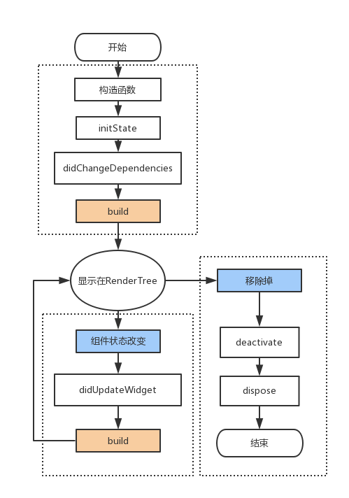
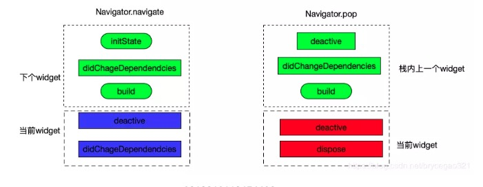
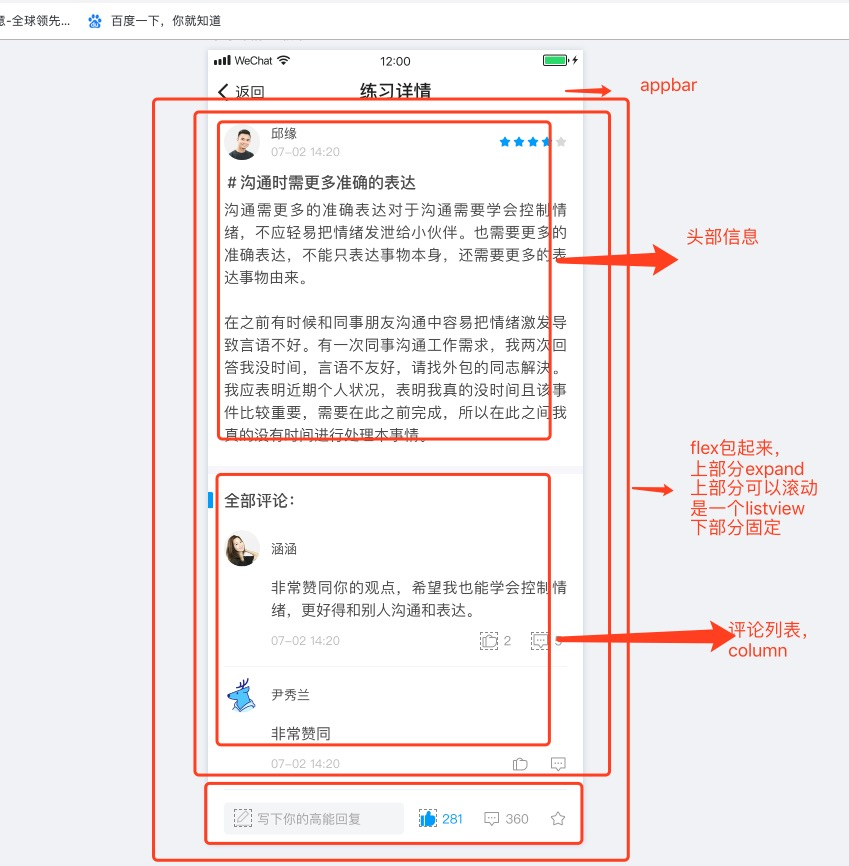

# flutter

### 跨平台技术简介

1. webview 渲染

   用 JavaScript 等前端技术进行开发，在客户端上用 WebView 来进行渲染。如微信小程序，cordova 等，

   优点：使用成熟的前端技术进行开发，学习成本低，开发效率高，并且支持动态发布代码。

   缺点：在性能体验上，和原生还是存在较大差距的。

2. 原生控件渲染

   这种方案，同样也是使用 JavaScript 开发，区别是它最终是调用原生控件进行渲染，如 React Native

   优点：使用原生控件进行渲染，性能体验也会更接近原生。

   缺点：但也只是更接近，和原生还是有差距的，因为它需要频繁的进行 JavaScript 和原生之间的通信，这个通信效率是比较低的。比如 RN 是通过 Jscore 解析 jsbunder 文件布局，和原生直接布局还是有那么一丁点差距的。由于需要适配各个平台的控件，那就有可能出现，系统控件更新了，而框架本身还没有更新，由此产生了一些问题。换句话说，这种方案是受到原生控件限制的。

3. 绘图引擎 Skia

   flutter 的 UI 渲染是基于 skia 图像引擎完成的，不依赖任何一个系统平台，平台仅仅提供一个画布，让 图像渲染在画布上。那么直接越过原生的渲染机制，从自身的渲染引擎去渲染视图，这就和原生一模一样，没有了中间商赚差价。

> 除了渲染上的区别，对于和原生服务的调用，别入照相、拍照、蓝牙，视频等，1 和 2 都是通过 bridge 协议来通讯的。3 flutter 是 用 Platform channel 的形式去调用系统服务

### 基础

flutter 开发语言：[dart](https://dart.dev/guides)

flutter [官方文档地址](https://flutter.dev/docs)

flutter [仓库地址](https://pub.dev)

### 学习路径

---

-- 入门 --

[中文文档地址](https://flutterchina.club/docs),按照上述的地址，完成起步的练习，初步了解 flutter 的使用，安装还有入门的过程中没有遇到阻碍，文档的安装和入门还是很亲和的。起步以后需要弄懂下面这二个基本的概念

#### 概念

1. widget

   不同于 Web 把页面分成了 HTML，CSS，JS， 在 Flutter 中，所有东西都是 widget 具体 widget 类型

   - 元素 widget。 如 button，menu，list
   - 样式 widget。如 font，color
   - 布局 widget。 如 padding，margin

   所有的 widget 嵌套组合在一起，就构成了一个 flutter app。

2. 状态

   分为 StatefulWidget 有状态 widget、StatelessWidget 无状态 widget

   - StatelessWidget 是不可变的, 这意味着它们的属性不能改变 - 所有的值都是最终的

   - StatefulWidget 当一个控件是可变的时候，就要使用 StatefulWidget 来构建。StatefulWidget 本身不可变，但它持有的状态 State 是可变的。

#### dart

flutter 使用 dart 作为开发语言，因此需要了解一下 dart 的基本语法

看了几遍 [dart 语法](https://www.jianshu.com/p/9e5f4c81cc7d)，这里的一些概括以后，简单的了解下语法，后续遇到问题，都是重新搜索文档，或者度娘搜索解决

---

-- 开发 --

有了上述简短的一些使用体验以后，开始开发我们自己的应用

从下面几个点开始深入开发

- 生命周期
- 布局、样式、交互
- 路由
- http 请求
- 状态
- 调试

#### 1 **生命周期**

##### 组件渲染

flutter 中的视图 Widget 也存在生命周期，生命周期的回调函数提现在了 State 上面。理解 flutter 的生命周期，对我们写出一个合理的控件至关重要。组件 State 的生命周期整理如下图所示：



大致可以看成三个阶段

    - 初始化（插入渲染树）
    - 状态改变（在渲染树中存在）
    - 销毁（从渲染树种移除）

1. initState：插入渲染树时调用，只调用一次，widget 创建执行的第一个方法，可以再里面初始化一些数据网络请求等，以及绑定控制器

2. didChangeDependencies：当 State 对象的依赖发生变化时会被调用；例如：在之前 build() 中包含了一个 InheritedWidget，然后在之后的 build() 中 InheritedWidget 发生了变化，那么此时 InheritedWidget 的子 widget 的 didChangeDependencies()回调都会被调用。InheritedWidget 这个 widget 可以由父控件向子控件共享数据，案例可以参考 scoped_model 开源库。

3. build ：它主要是用于构建 Widget 子树的，调用次数：多次，初始化之后开始绘制界面，当 setState 触发的时候会再次被调用

4. didUpdateWidget：组件状态改变时候调用，可能会调用多次

5. deactivate:当 State 对象从树中被移除时，会调用此回调。

6. dispose():当 State 对象从树中被永久移除时调用；通常在此回调中释放资源。

7. reassemble：此回调是专门为了开发调试而提供的，在热重载(hot reload)时会被调用，此回调在 Release 模式下永远不会被调用。
   几个注意点

二个页面之前的切换的流程如图


##### flutter 前后台交互

在我们原生 Android（或者 IOS）开发中，很多是否要在对应的生命周期做一些事件，例如 App 从后台进入前台，从前台退入后台（或被遮盖），以及需要在确保 UI 绘制后做一些处理，这在我们原生开发中很容易做到，那么在 Flutter 中需要怎么去做呢？

很简单，给 WidgetsBinding 设置 Observer

```

class _MyHomePageState extends State<MyHomePage> with WidgetsBindingObserver{

  @override
  void initState() {
    super.initState();
    WidgetsBinding.instance.addObserver(this); // 添加观察者
  }

  @override
  void didChangeAppLifecycleState(AppLifecycleState state) {
    super.didChangeAppLifecycleState(state);
    print("lifeChanged $state");
    switch (state) {
      case AppLifecycleState.inactive: // 用户可见，但不可响应用户操作
        break;
      case AppLifecycleState.resumed: // 应用可见并可响应用户操作
        break;
      case AppLifecycleState.paused: // 已经暂停了，用户不可见、不可操作
        break;
      case AppLifecycleState.suspending: // 应用被挂起，此状态IOS永远不会回调
        break;
    }
  }

  @override
  void dispose() {
    super.dispose();
    WidgetsBinding.instance.removeObserver(this); // 销毁
  }

  @override
  Widget build(BuildContext context) {
    return Container();
  }
}

```

我们只要给 WidgetsBinding 的单例对象添加 WidgetsBindingObserver，然后此类粘合(with)WidgetsBindingObserver 抽象类

```
abstract class WidgetsBindingObserver {

   //路由弹出Future
  Future<bool> didPopRoute() => Future<bool>.value(false);

    //新的路由Future
  Future<bool> didPushRoute(String route) => Future<bool>.value(false);

    //系统窗口相关改变回调，例如旋转
  void didChangeMetrics() { }

    //文字系数变化
  void didChangeTextScaleFactor() { }

    //本地化语言变化
  void didChangeLocales(List<Locale> locale) { }

    //生命周期变化
  void didChangeAppLifecycleState(AppLifecycleState state) { }

    //低内存回调
  void didHaveMemoryPressure() { }

    //当前系统改变了一些访问性活动的回调
  void didChangeAccessibilityFeatures() {}
}
```

其中我们重写了 override 了 didChangeAppLifecycleState，这个方法有一个参数类型为 AppLifecycleState 的枚举类，我们可以根据它的状态来处理我们的一些任务。

---

#### 2 **布局、样式、交互**

布局组件

-- 基础组件 --

1. Container

   容器，一个常用的控件，由基本的绘制、位置和大小控件组成。负责创建矩形的可视元素，可以用 BoxDecoration 来设计样式，比如背景、边框和阴影，Container 也有边距、填充和大小限制，另外，还可以在三维空间利用矩阵进行变换。

   推荐文章介绍，[地址](https://www.jianshu.com/p/366b2446eaab)

2. Row

   在水平方向上排列子 widget 的列表。

   表现形式跟 web 的 flex 类似,可以完成参照 flex 布局的介绍

   其中用的比较多的就是

   MainAxisAlignment 设置主轴方向上的对齐方式

   CrossAxisAlignment 设置交叉轴方向的对齐方式

   输入的时候会有提示拥有的可以设置的属性，比较简单

   ```
    Row(
        children: <Widget>[
            Expanded(
            child: Container(
                color: Colors.red,
                padding: EdgeInsets.all(5.0),
            ),
            flex: 1,
            ),
            Expanded(
            child: Container(
                color: Colors.yellow,
                padding: EdgeInsets.all(5.0),
            ),
            flex: 2,
            ),
            Expanded(
            child: Container(
                color: Colors.blue,
                padding: EdgeInsets.all(5.0),
            ),
            flex: 1,
            ),
        ],
    )
   ```

   一个很简单的例子，使用 Expanded 控件，将一行的宽度分成四个等分，第一、三个 child 占 1/4 的区域，第二个 child 占 1/2 区域，由 flex 属性控制。

3. Column

   在垂直方向上排列子 widget 的列表。
   表现形式跟 web 的 flex 类似,可以完成参照 flex 布局的介绍

   ```
    new Column(
        mainAxisAlignment: MainAxisAlignment.spaceEvenly,
        mainAxisSize: MainAxisSize.max,
        crossAxisAlignment: CrossAxisAlignment.center,
        verticalDirection: VerticalDirection.down,
        // textDirection:,
        textBaseline: TextBaseline.alphabetic,
        children: <Widget>[
            Container(
                color: Colors.red,
                height: 30,
                width: 30,
            ),
            Container(
                color: Colors.blue,
                height: 30,
                width: 30,
            ),
            Container(
                color: Colors.yellow,
                height: 30,
                width: 30,
            ),
        ],
    ),

   ```

4. Image

   一个显示图片的 widget

   推荐文档 [地址](https://www.jianshu.com/p/9b21dca71e3f)

   推荐使用 [cached_network_image](https://pub.dev/packages/cached_network_image) 去处理图片，可以很方便的增加图片 loading 效果，还有加载失败的效果

5. Text

   单一格式的文本

   ```
    new Text(
        '学习Text',
        textAlign: TextAlign.center, // 文本对齐方式  居中
        textDirection: TextDirection.ltr, // 文本方向
        softWrap: false, // 是否自动换行 false文字不考虑容器大小  单行显示   超出；屏幕部分将默认截断处理
        overflow: TextOverflow
            .ellipsis, // 文字超出屏幕之后的处理方式  TextOverflow.clip剪裁   TextOverflow.fade 渐隐  TextOverflow.ellipsis省略号
        textScaleFactor: 2.0, // 字体显示的倍率
        maxLines: 10, // 最大行数
        style: new TextStyle(
        decorationColor: const Color(0xffffffff), // 线的颜色
        decoration: TextDecoration
            .none, // none无文字装饰   lineThrough删除线   overline文字上面显示线    underline文字下面显示线
        decorationStyle: TextDecorationStyle
            .solid, // 文字装饰的风格  dashed,dotted虚线(简短间隔大小区分)  double三条线  solid两条线
        wordSpacing: 0.0, // 单词间隙(负值可以让单词更紧凑)
        letterSpacing: 0.0, // 字母间隙(负值可以让字母更紧凑)
        fontStyle: FontStyle.italic, // 文字样式，斜体和正常
        fontSize: 20.0, // 字体大小
        fontWeight: FontWeight.w900, // 字体粗细  粗体和正常
        color: const Color(0xffffffff), // 文字颜色
    ),

   ```

6. Icon

   A Material Design icon.
   系统提供的一些 icon 样式安卓风格
   或者使用 [cupertino_icons](https://pub.dev/packages/cupertino_icons) iOS 风格 icon

7. Input

   推荐文档 [地址](https://juejin.im/post/5c20787fe51d4554055562fd#heading-6)

   ```
   const TextField({
       Key key,
       this.controller,    //编辑框的控制器，跟文本框的交互一般都通过该属性完成，如果不创建的话默认会自动创建
       this.focusNode,  //用于管理焦点
       this.decoration = const InputDecoration(),   //输入框的装饰器，用来修改外观
       TextInputType keyboardType,   //设置输入类型，不同的输入类型键盘不一样
       this.textInputAction,   //用于控制键盘动作（一般位于右下角，默认是完成）
       this.textCapitalization = TextCapitalization.none,
       this.style,    //输入的文本样式
       this.textAlign = TextAlign.start,   //输入的文本位置
       this.textDirection,    //输入的文字排列方向，一般不会修改这个属性
       this.autofocus = false,   //是否自动获取焦点
       this.obscureText = false,   //是否隐藏输入的文字，一般用在密码输入框中
       this.autocorrect = true,   //是否自动校验
       this.maxLines = 1,   //最大行
       this.maxLength,   //能输入的最大字符个数
       this.maxLengthEnforced = true,  //配合maxLength一起使用，在达到最大长度时是否阻止输入
       this.onChanged,  //输入文本发生变化时的回调
       this.onEditingComplete,   //点击键盘完成按钮时触发的回调，该回调没有参数，(){}
       this.onSubmitted,  //同样是点击键盘完成按钮时触发的回调，该回调有参数，参数即为当前输入框中的值。(String){}
       this.inputFormatters,   //对输入文本的校验
       this.enabled,    //输入框是否可用
       this.cursorWidth = 2.0,  //光标的宽度
       this.cursorRadius,  //光标的圆角
       this.cursorColor,  //光标的颜色
       this.keyboardAppearance,
       this.scrollPadding = const EdgeInsets.all(20.0),
       this.dragStartBehavior = DragStartBehavior.down,
       this.enableInteractiveSelection,
       this.onTap,    //点击输入框时的回调(){}
       this.buildCounter,
   })

   InputDecoration({
       this.icon,    //位于装饰器外部和输入框前面的图片
       this.labelText,  //用于描述输入框，例如这个输入框是用来输入用户名还是密码的，当输入框获取焦点时默认会浮动到上方，
       this.labelStyle,  // 控制labelText的样式,接收一个TextStyle类型的值
       this.helperText, //辅助文本，位于输入框下方，如果errorText不为空的话，则helperText不会显示
       this.helperStyle, //helperText的样式
       this.hintText,  //提示文本，位于输入框内部
       this.hintStyle, //hintText的样式
       this.hintMaxLines, //提示信息最大行数
       this.errorText,  //错误信息提示
       this.errorStyle, //errorText的样式
       this.errorMaxLines,   //errorText最大行数
       this.hasFloatingPlaceholder = true,  //labelText是否浮动，默认为true，修改为false则labelText在输入框获取焦点时不会浮动且不显示
       this.isDense,   //改变输入框是否为密集型，默认为false，修改为true时，图标及间距会变小
       this.contentPadding, //内间距
       this.prefixIcon,  //位于输入框内部起始位置的图标。
       this.prefix,   //预先填充的Widget,跟prefixText同时只能出现一个
       this.prefixText,  //预填充的文本，例如手机号前面预先加上区号等
       this.prefixStyle,  //prefixText的样式
       this.suffixIcon, //位于输入框后面的图片,例如一般输入框后面会有个眼睛，控制输入内容是否明文
       this.suffix,  //位于输入框尾部的控件，同样的不能和suffixText同时使用
       this.suffixText,//位于尾部的填充文字
       this.suffixStyle,  //suffixText的样式
       this.counter,//位于输入框右下方的小控件，不能和counterText同时使用
       this.counterText,//位于右下方显示的文本，常用于显示输入的字符数量
       this.counterStyle, //counterText的样式
       this.filled,  //如果为true，则输入使用fillColor指定的颜色填充
       this.fillColor,  //相当于输入框的背景颜色
       this.errorBorder,   //errorText不为空，输入框没有焦点时要显示的边框
       this.focusedBorder,  //输入框有焦点时的边框,如果errorText不为空的话，该属性无效
       this.focusedErrorBorder,  //errorText不为空时，输入框有焦点时的边框
       this.disabledBorder,  //输入框禁用时显示的边框，如果errorText不为空的话，该属性无效
       this.enabledBorder,  //输入框可用时显示的边框，如果errorText不为空的话，该属性无效
       this.border, //正常情况下的border
       this.enabled = true,  //输入框是否可用
       this.semanticCounterText,
       this.alignLabelWithHint,
   })

   ```

8. ListView
   可滚动的列表视图
   推荐文档 [地址](https://juejin.im/post/5cb1c9d5f265da037371777f)

-- 系统提供的二种 ui 风格 --

- Cupertino (iOS)

- Material (Android)

  需要了解 [App 结构和导航](https://www.jianshu.com/p/add5a6e5c87a)

-- 屏幕适配 --

推荐 [地址](https://juejin.im/post/5bc5a56a5188255c352d88fe)

> 上述只是简单介绍了一下页面布局用的常见的一些元素，还有很多组件比如动画等其他组件请自行查阅文档

-- 布局思路 --

首先整体拆解，然后局部拆分

如图



然后对头部练习主体进一步拆解

对评论列表进行拆解

思路基本跟前端的布局一样，如果不熟悉的情况下，可以在给每个部分增加背景颜色查看效果

-- 实践过程中的一些经验总结 --

1. 颜色和边距类

   Colors 有很多默认的颜色值，输入的时候会有提示
   自定义颜色 Color(0xff4caf50)
   在 flutter 中，color 使用的是 ARGB，0x 后面的就是 ARGB，A 就是 FF 表示透明度，RGB 就是三原色了，上述对应的 web 端的#4caf50

   Color.fromRGBO(int r, int g, int b, double opacity) 类似 web 的 rgba

   EdgeInsets 通常用来设置间距的大小，输入的时候提示也比较明显

2. 关于 刘海屏适配

   [SafeArea](https://juejin.im/post/5ce73cc2f265da1b68369645)

3. 键盘弹起，页面整体往上移

   使用 resizeToAvoidBottomInset 指定在键盘出现时是否应调整主体的大小
   可以在 Scaffold 里面 resizeToAvoidBottomInset 设置为 false 页面就不会往上弹

4. 类似于前端的 display: none

   可以使用 Offstage 包起来。设置 offstage 属性
   当 offstage 为 true，控件隐藏； 当 offstage 为 false，显示；
   当 Offstage 不可见的时候

5. 禁止表单的点击

   AbsorbPointer 可以想象成 web 端的遮罩，众所周知周知，禁止表单的点击时间有 disabled，但是这样一来，如果页面比较复杂，要控制表单元素是否可点那可成了灾难，这时候 AbsorbPointer 就可以快速解决这个问题。我们可以把它看成是一个透明的穹顶，一旦打开，从外部是无法到达内部。不过有一点值得注意，如果一个输入框已经获取焦点，然后再打开穹顶，输入框还是可以输入的。

   属性

   - absorbing 布尔类型，字面意思是吸收，通俗点讲这个属性就是用来控制其 child 里面的组件是否可以点击，通常用的最多的也是这个属性。

   - child Widget 类型，可以是任何组件。

   - ignoringSemantics 布尔类型，是否忽略语义。经测试没什么影响，一般使用比较少。

6. 手势操作

   使用 [GestureDetector](https://www.jianshu.com/p/dc4853c33562)
   还有一些常用的简单带动画效果的 InkWell

7. tab 的切换

   可以使用 TabBarView,也可以使用 Pageview,或者直接使用 IndexedStack
   前面二种带动画可以左右华东，IndexedStack 如果也想要动画，推荐包括一层[这个](https://github.com/best-flutter/transformer_page_view)

8. 滚动处理

---

#### 3 **路由**

---

#### 4 **http 请求**

---

#### 5 **状态**

---

#### 6 **调试**

---
